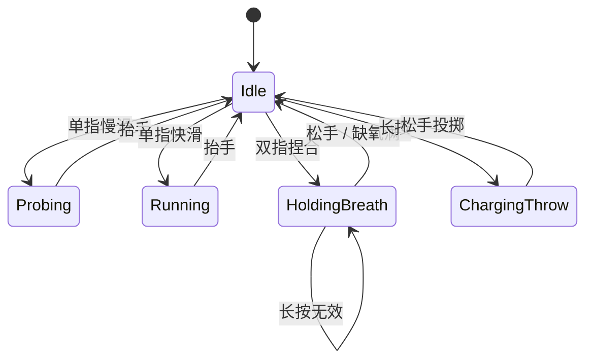

# 《盲径》游戏设计文档（GDD）完整版

| 字段 | 内容 |
|------|------|
| 项目代号 | BLINDPATH |
| 文档版本 | v0.2 |
| 文档状态 | 可评审 |
| 对应策划案 | [策划案_01_盲径.md](./策划案_01_盲径.md) |

---

## 1. 执行摘要

《盲径》是一款**全程无画面输出**（黑屏）的手机游戏。玩家在废弃设施中扮演无名逃亡者，仅凭**立体声环境、材质触感音效、呼吸与心跳混音**，以及**多点触控手势**进行寻路与生存，躲避以听觉为主要感知手段的追击者「猎声」。

**商业一句话**：把「恐怖游戏里不敢回头」升级为「根本没有回头可见」——把空间音频与触控材质反馈做成核心玩法，而非包装。

---

## 2. 设计支柱（不可妥协）

1. **黑屏即承诺**：默认无 UI 像素；任何破坏沉浸的 HUD 必须以「可选无障碍层」形式存在，且默认关闭。
2. **耳朵即地图**：路径记忆负担来自**材质音色差异**与**空间化声源**，而非迷你地图。
3. **触控即身体**：手势对应身体动作（探路、屏息、投掷），输入延迟与触觉反馈须与叙事一致。
4. **公平可听**：难度来自信息密度与注意力分配，而非「听不见的超高频」或听力歧视；提供辅助节拍与对比度式音频增强（见 §11）。

---

## 3. 愿景与参考体验

**目标体验**：戴耳机、关灯、单手握机，15 分钟内完成一次「高压—喘息—顿悟」的弧光；重复可玩性来自关卡随机化与猎声 AI 行为变体。

**非目标**：不做开放世界；不做复杂装备养成；不做强社交排行（可保留匿名速通榜，无对战）。

---

## 4. 平台、发行与技术约束

| 项目 | 规格 |
|------|------|
| 首发平台 | iOS / Android 手机 |
| 最低音频 | 立体声耳机强烈推荐；外放仅保证可玩、不保证平衡 |
| 触控 | 电容屏多点触控；压感（3D Touch / 压力曲线）为增强项 |
| 传感器 | 本 GDD 核心循环**不依赖**陀螺仪；可选「手持晃动」彩蛋关 |
| 包体 | 语音 + 环境音库主导，目标首包 ≤ 800MB（可分包下载） |
| 引擎建议 | Unity / Unreal + Wwise 或 FMOD；HRTF 用引擎或中间件方案 |

---

## 5. 目标用户与场景

**核心用户**：18–35 岁，接受恐怖/紧张氛围，习惯播客与 ASMR，有耳机使用场景。

**次要用户**：视觉障碍玩家（若严格实现读屏与纯音频模式，可单独里程碑）。

**典型场景**：通勤末段 10–20 分钟；睡前关灯（需亮度与内容警告）。

---

## 6. 核心循环（60 秒级）

```
听环境（风声/滴水/远处广播）
    → 单指探路（材质反馈 + 碰壁震动）
    → 判断安全方向 / 陷阱（积水导电声、玻璃渣等）
    → 遭遇猎声接近（脚步/喉音空间化）
    → 决策：屏息（双指捏合）/ 投掷石子（长按）/ 疾走（快滑）
    → 到达检查点（录音机碎片播放叙事）
    → 危险等级回落，进入下一段寻路
```

**心流节拍**：每 2–4 分钟一次「猎声高压峰」，峰后必有 20–40 秒「可探索叙事窗」。

---

## 7. 系统与机制详述

### 7.1 探路（Probe）

- **输入**：单指在屏幕上**缓慢滑动**（速度阈值以下为「摸索」，以上为「奔跑」）。
- **输出**：沿滑动方向发射「虚拟探针」射线（玩家不可见），命中碰撞体时播放**材质 One-Shot**，并叠加**短混响尾音**（空间大小暗示）。
- **碰壁**：探针长度上限触达时，**边缘触觉短震** + 闷响「咚」。
- **积水**：特殊材质；滑过时有黏滞感音效 + 轻微高频啸叫（暗示导电风险，与后续机关关联）。

### 7.2 屏息（Hold Breath）

- **输入**：双指捏合保持。
- **效果**：玩家脚步/衣物摩擦 **RTPC 下调**；猎声「警觉值」上升速率减半；玩家「缺氧」计量表上升（无 UI，以呼吸声渐促、视野外无、仅音频滤波变窄暗示）。
- **释放**：松手后一次可听见的「换气」；若此时猎声在警戒阈值上，可能触发追击。

### 7.3 投掷石子（Distraction）

- **输入**：长按（≥ 0.45s）后松手，石子落点映射为**最近一次探路命中点前方固定距离**（避免需要瞄准 UI）。
- **资源**：每关 2–4 枚；拾取叙事道具「碎石袋」可补充（语音说明）。
- **效果**：远处金属/玻璃碰撞声，猎声 AI 向声源偏移 3–8 秒。

### 7.4 奔跑与噪音

- **输入**：快速滑动或双段「跺脚」手势（两指快速交替点）。
- **代价**：脚步响度与猎声侦测半径上升；部分地板「吱呀」连锁触发环境事件。

### 7.5 叙事检查点：录音机碎片

- **触发**：进入音量球体（玩家仅听到磁带仓咔哒与 GUIDING 语音）。
- **内容**：30–90 秒独白/对话，期间通常**冻结猎声巡逻**（防读条死）；部分关卡为「伪安全」——磁带 B 面有猎声呼吸。

---

## 8. 敌人与 AI：《猎声》

### 8.1 感知模型

- **主感知**：玩家发出的**总响度**（脚步、呼吸、石子、环境交互）在猎声处积分。
- **次感知**：**声源方向**（HRTF）；拐角处用低通滤波模拟遮挡。
- **弱感知**：玩家「气味」仅在特定关卡启用（叙事关），以蝇群嗡嗡靠近表示，非写实。

### 8.2 状态机（简）

`Idle（巡逻）` → `Investigate（调查可疑声）` → `Pursue（追击）` → `Lost（丢失）` → 回到 `Idle`  
玩家屏息成功 + 躲入「声学死角」（厚帘后）可强制转入 `Lost`。

### 8.3 难度旋钮

- 巡逻路径长度、Investigate 停留时间、Pursue 移速、环境底噪强度。

---

## 9. 关卡与进程结构

### 9.1 幕次（Act）建议

| 幕 | 主题 | 新机制 | 目标时长（首通） |
|----|------|--------|------------------|
| Act I | 地下泵房 | 基础探路、猎声登场 | 25–35 min |
| Act II | 档案走廊 | 假墙（空心敲击声）、广播干扰 | 30–40 min |
| Act III | 顶层天桥 | 风雨掩噪、窄桥失衡音效 | 25–35 min |
| Act IV | 核心机房 | 电磁嗡鸣掩蔽定位、限时断电安静窗 | 35–45 min |

### 9.2 单关白盒（文字拓扑示例）— Act I-03「积水阀厅」

1. 出生点：滴水声在左前；玩家探路知左侧管道、右侧开阔。
2. 中段：地面积水带（宽 2m 概念）；快速跑过触发电弧音效（不伤血，但**极大提高猎声警觉**）。
3. 分支：A 短险快；B 绕远有石子补给。
4. Boss 窗：猎声从玩家身后走廊同步逼近；需石子引开 + 屏息过阀门口。

---

## 10. 叙事设计

### 10.1 故事梗概（可替换）

逃亡者醒来于封锁设施，设施曾进行「感官剥夺与声学武器」实验。猎声为失败品或安保 AI 拟人化（留白）。真结局与「谁按下广播总闸」相关。

### 10.2 交付物

- 录音机碎片脚本：**约 45–60 段**，每段 ≤ 90s。
- 环境广播：**8–12 条**循环新闻/通告，随 Act 替换。
- **禁止**：过度依赖视觉描述台词（「你看那边红光」类）。

---

## 11. 音频规格

### 11.1 混音与动态

- 集成响度目标：**-16 LUFS** 左右（流媒体友好），峰值 -1 dBTP；恐怖峰不超过用户设定「安全音量」上限。
- 使用 **HDR 音频**或侧链ducking，保证耳语可辨、尖叫不毁听力。

### 11.2 空间化

- 耳机模式：**HRTF**；外放：**简化 pan + 距离衰减**。
- 垂直差异用 EQ 与早期反射密度差表现（管道 vs 大厅）。

### 11.3 材质听觉表（附录摘要）

| 材质 ID | 探路音色关键词 | 叙事联想 |
|---------|----------------|----------|
| MET_RAIL | 高频金属颤音 | 扶手、楼梯 |
| FAB_HEAVY | 闷击、少泛音 | 帘、隔音毯 |
| CON_WET | 啪嗒、黏着 | 积水、危险 |
| GL_SHARD | 尖锐碎裂感 | 玻璃渣路径 |
| TILE_CRK | 脆性裂纹 | 易响地板 |

### 11.4 音乐

- **非连续配乐**为主；仅在安全叙事窗铺极淡铺底（避免掩盖线索）。
- 猎声逼近时：**节奏性脉冲**与心跳对齐（BPM 随距离变化）。

---

## 12. 触控与触觉（实现级）

| 手势 | 识别要点 | 触觉 |
|------|----------|------|
| 慢滑探路 | 速度 < v_probe | 材质命中时轻触 |
| 快滑奔跑 | 速度 > v_run | 可选节奏轻踏 |
| 双指捏合 | 两指距离 < d_hold 持续 | 屏息开始轻吸、缺氧临界短促三连 |
| 长按投石 | duration ≥ 0.45s | 释放时中震 |
| 碰壁 | 探针用尽 | 边缘短震 |

**误触防护**：捏合需两指同时出现；投石长按若在捏合态则无效。

---

## 13. UI / UX（无画面前提）

- **主界面**：黑屏 + 菜单语音导航（上下滑切换、双击确认）；或系统无障碍菜单接管。
- **暂停**：三指长按 0.8s（可调）+ 确认语音提示。
- **教程**：首关「教练」仅为无线电耳机里的同事声音，分步解锁手势。

---

## 14. 无障碍与伦理

- **字幕模式**：默认关；开启后仅显示**对话与系统提示**，无画面构图。
- **单声道模式**：折叠 HRTF，用音量差与时间差补偿。
- **高频衰减预设**：敬老模式。
- **内容警告**：幽闭、追逐、轻微 gore（**仅听觉**的血滴落声等）可分级关闭。
- **癫痫**：无闪光；若未来加「假 UI」彩蛋须单独声明。

---

## 15. 技术架构概要

```
[触控采样] → [手势 FSM] → [玩家响度 RTPC]
                    ↓
[物理/简化碰撞探针] → [材质查询] → [Wwise Event]
                    ↓
[猎声 AI] ← [空间化总线] ← [环境声床 + 叙事语音]
                    ↓
[游戏状态] → [存档点] / [章节加载]
```

- **存档**：检查点制 + 章节自动存档；无存档时死亡从本段起点。
- **性能**：同屏事件数上限；流式加载 Act 音库。

---

## 16. 商业模式（可选）

- 一次性付费（推荐）或本体免费 + Act II 起 IAP。
- 无抽卡；可选皮肤为「环境声包」（雨林回响设施）非数值。

---

## 17. 内容规模与工期（粗估，团队相关）

| 模块 | 人周（量级） |
|------|----------------|
| 核心玩法原型 | 4–8 |
| 猎声 AI 与关卡脚本工具 | 6–12 |
| 音频资产（不含配音录制） | 12–20 |
| 配音与本地化（中英） | 8–16 |
| 无障碍与 QA | 6–10 |

---

## 18. 风险与对策

| 风险 | 对策 |
|------|------|
| 外放体验差 | 开局强提示耳机；外放专用混音预设 |
| 3D 音眩晕 | 降低早期反射；可选「弱空间化」 |
| 学习曲线陡 | 分层教程关；辅助「节拍脚步」开关 |
| 叙事被跳过 | 碎片可重复在检查点收听 |
| 法规与恐怖分级 | 分区年龄评级与内容开关 |

---

## 19. 附录 A：玩家手势状态机（Mermaid）



---

## 20. 附录 B：验收标准（节选）

1. 黑屏模式下，新手可在**语音引导**下 8 分钟内完成 Act0 教程关。
2. 十种材质中，盲测玩家**≥70%** 正确辨认其中 7 种（内部 playtest 指标）。
3. 触控端到音频触发 **p95 延迟 ≤ 80ms**（设备中端机）。
4. 连续游玩 45 分钟，集成响度不触发系统听力警告（在默认设置下）。

---

## 21. 文档修订记录

| 版本 | 日期 | 说明 |
|------|------|------|
| v0.1 | — | 自十案总表拆出 |
| v0.2 | — | 补系统、AI、关卡白盒、音频与无障碍 |

---

*本文档为《盲径》立项与原型对齐用；数值与工期需经制作人评审后锁定。*
